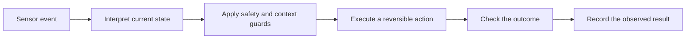

# Start Here

> *Building a Stateful Smart Home* is an educational book about designing automation that is reliable, understandable and recoverable.

## Choose a path

| Reader goal | Recommended route |
|---|---|
| New to smart-home automation | [Preface](Preface.md) → [Engineering Principles](Engineering%20Principles.md) → [System Overview](../01%20Architecture/System%20Overview.md) |
| Building with automation controller | [Advanced Flows](../05%20Homey/Advanced%20Flows/Advanced%20Flows.md) → [Variables](../05%20Homey/Variables/Variables.md) → [Flow Catalogue](../05%20Homey/Flow%20Catalogue.md) |
| Solving unreliable automations | [Stateful Automation Architecture](../01%20Architecture/Stateful%20Automation%20Architecture.md) → [Presence Intelligence](../03%20Systems/Presence/Presence%20Intelligence.md) → [Troubleshooting](../07%20Operations/Troubleshooting.md) |
| Planning a new system | [Technology Stack](../01%20Architecture/Technology%20Stack.md) → [Zone Design](../02%20Rooms/Zone%20Design.md) → [Roadmap](../08%20Roadmap/Roadmap.md) |
| Reviewing this release | [Publication Scope and Privacy](Publication%20Scope%20and%20Privacy.md) → [Publication Audit](Publication%20Audit.md) → [Release Candidate Report](Release%20Candidate%20Report.md) |

## What this book teaches

The central lesson is simple: an event is not a conclusion. A motion or presence event must be interpreted alongside time, device state, user intent and failure conditions before an automation changes the home.

## Status key

- **Tested** — demonstrated under recorded conditions.
- **Pattern** — sound engineering guidance, but not proof for every installation.
- **Proposed** — a design to evaluate, not a claim of capability.

## Publication boundary

[Publication Scope and Privacy](Publication%20Scope%20and%20Privacy.md) defines what this public edition intentionally omits. Use a private operational repository—not this book—for any real device inventory, plans, access instructions or security configuration.
