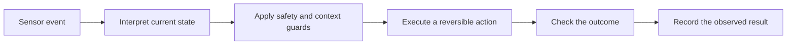

# Start Here

> *Building a Stateful Smart Home* is an educational book about designing automation that is reliable, understandable and recoverable.

## Choose a path

| Reader goal | Recommended route |
|---|---|
| New to smart-home automation | [[Preface]] → [[Engineering Principles]] → [[System Overview]] |
| Building with automation controller | [[Advanced Flows]] → [[Variables]] → [[Flow Catalogue]] |
| Solving unreliable automations | [[Stateful Automation Architecture]] → [[Presence Intelligence]] → [[Troubleshooting]] |
| Planning a new system | [[Technology Stack]] → [[Zone Design]] → [[Roadmap]] |
| Reviewing this release | [[Publication Scope and Privacy]] → [[Publication Audit]] → [[Release Candidate Report]] |

## What this book teaches

The central lesson is simple: an event is not a conclusion. A motion or presence event must be interpreted alongside time, device state, user intent and failure conditions before an automation changes the home.

## Status key

- **Tested** — demonstrated under recorded conditions.
- **Pattern** — sound engineering guidance, but not proof for every installation.
- **Proposed** — a design to evaluate, not a claim of capability.

## Publication boundary

[[Publication Scope and Privacy]] defines what this public edition intentionally omits. Use a private operational repository—not this book—for any real device inventory, plans, access instructions or security configuration.
