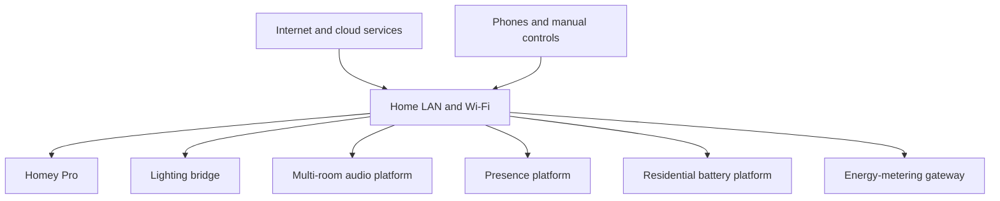

# Network Topology

## Scope

This chapter records logical dependencies without publishing credentials, IP addresses, Wi-Fi names, or security-sensitive configuration. It is a generic teaching topology, not a diagram of a real home network.

## Dependency classes

| Class | Examples | Expected outage effect |
|---|---|---|
| Local automation | Homey Pro, lighting bridge, LAN | Cross-system or lighting automation may degrade |
| Local media | multi-room audio devices and LAN | Playback/group changes may fail |
| Cloud-assisted integration | Vendor APIs where applicable | Telemetry or remote commands may be delayed/unavailable |
| Manual control | Physical switches, vendor apps on LAN | Must remain available where technically possible |

## Rules

- Do not store passwords, tokens, recovery codes, full IP plans, or alarm details in Git.
- Reserve stable addresses only when an integration demonstrably needs them; record the rule, not the secret.
- Document whether a control path is local, cloud-dependent, or unknown.
- Test outage behavior before claiming local execution.
- Back up router configuration separately and protect it as sensitive material.

## Verification queue

- Confirm router, access point, switch, VLAN, and DNS equipment.
- Confirm Ethernet versus Wi-Fi connections for Homey Pro, the lighting bridge, multi-room audio, residential battery platform, and metering gateway.
- Confirm which Homey Pro integrations continue operating during an internet outage.
