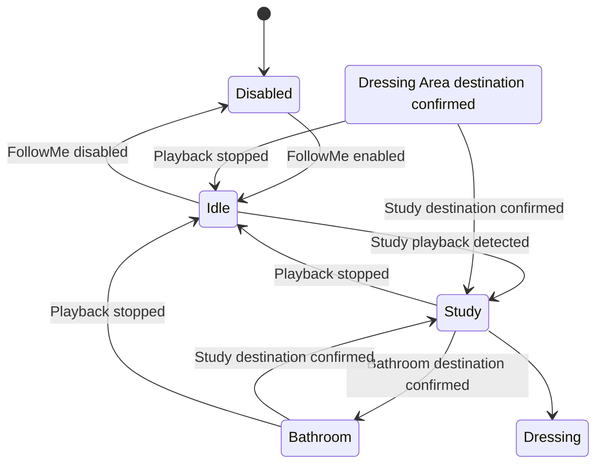
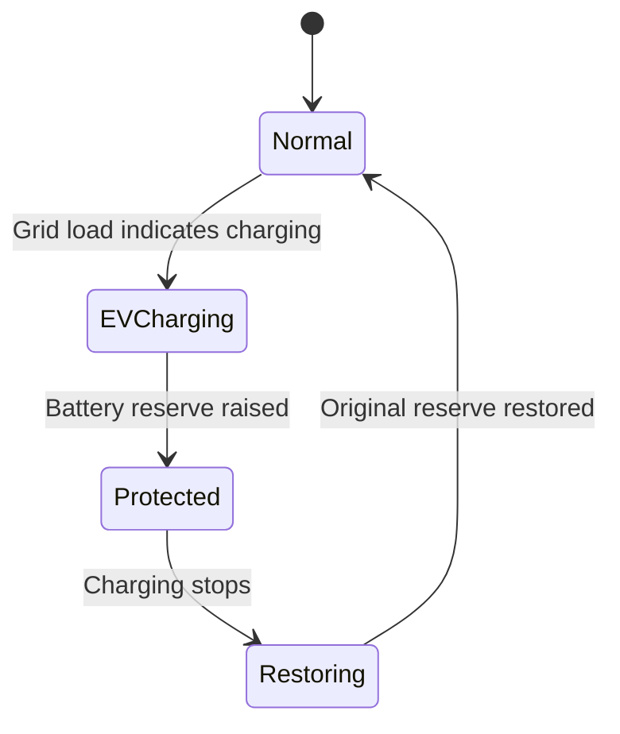
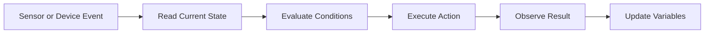

# Stateful Automation Architecture

> [!note] Reference model
> Patterns in this chapter are design guidance. A worked example is not considered deployed until it appears with evidence in [Flow Catalogue](../05%20Homey/Flow%20Catalogue.md).

## 1. Introduction

A smart home becomes unreliable when every automation reacts only to the latest event.

Events are temporary. They describe something that happened:

- presence was detected;
- a lux value changed;
- a speaker started playing;
- a car began charging;
- a battery reserve was updated.

A useful home-intelligence system also needs memory. It must retain enough context to understand what those events mean.

That memory is state.

State answers questions such as:

- Which room currently owns the audio session?
- Is follow-me audio enabled?
- Which room was active before the current room?
- Is the home in day, evening or night mode?
- Is the battery temporarily protected from EV charging?
- Has a manual override been activated?

Stateful automation is the discipline of combining events, persistent context and controlled transitions so that the home behaves consistently over time.

## 2. Event-Driven Automation Is Not Enough

A basic automation is often written as:

```text
WHEN something happens
THEN perform an action
```

Example:

```text
WHEN Bathroom presence is detected
THEN turn on the Bathroom light
```

This works only while the required decision is simple.

The moment context matters, more information is needed:

```text
WHEN Bathroom presence is detected
AND the room is dark enough
AND lighting automation is enabled
AND no manual override is active
THEN activate the correct Bathroom scene
```

The trigger remains an event. The conditions are state.

Without state, every detection is treated as if it happened in isolation. The system cannot distinguish between:

- entering a room and already being in it;
- automatic playback and manually selected playback;
- temporary battery protection and normal operation;
- a genuine room transition and a false sensor activation.

## 3. The Three Elements of Stateful Automation

Every robust automation contains three conceptual elements.

### 3.1 Event

The event starts evaluation.

Examples:

- presence becomes active;
- speaker starts playing;
- power consumption exceeds a threshold;
- timer expires;
- variable changes.

### 3.2 State

State provides context.

Examples:

- `Audio_Current_Room = Study`;
- `Audio_FollowMe = Yes`;
- `Lighting_Automation = Enabled`;
- `EV_Charging = Yes`;
- `Battery_Protection = Active`.

### 3.3 Transition

A transition changes the system from one valid state to another.

Example:

```text
Audio_Current_Room: Study -> Bathroom
```

A transition should include both the physical action and the state update.

For follow-me audio:

1. Bathroom joins the Study multi-room audio group.
2. Study leaves the group.
3. `Audio_Previous_Room` becomes Study.
4. `Audio_Current_Room` becomes Bathroom.

The state change is not an administrative afterthought. It is part of the automation itself.

## 4. State Categories

Not all state should be managed in the same way.

### 4.1 Device state

This is reported by a physical device or native platform.

Examples:

- multi-room audio is playing;
- Bathroom presence is active;
- grid import is 4.2 kW;
- battery state of charge is 58 percent;
- a light is on.

Device state should be used directly when it is trustworthy and current.

### 4.2 Derived state

Derived state is calculated from one or more device states.

Examples:

- room is dark enough;
- EV charging is active;
- Transition Corridor is acting as a transition zone;
- current energy mode is surplus charging;
- current destination is Bathroom.

Derived state makes complex decisions easier to understand and reuse.

### 4.3 Intent state

Intent state represents what the occupants want the system to do.

Examples:

- follow-me audio enabled;
- guest mode enabled;
- lighting automation disabled;
- do not discharge battery during EV charging;
- bedtime mode active.

Intent must not be confused with observed reality. `Audio_FollowMe = Yes` does not mean audio is currently playing. It only means automatic transfer is allowed.

### 4.4 Historical state

Historical state retains limited memory of what happened before.

Examples:

- previous audio room;
- previous battery reserve;
- last occupied destination;
- last manual scene;
- timestamp of the latest hallway detection.

Historical state is useful for restoration, route interpretation and troubleshooting.

### 4.5 Temporary control state

Temporary control state prevents overlapping automations.

Examples:

- audio transfer in progress;
- battery reserve update in progress;
- lighting scene transition active;
- cooldown timer running.

This state is often called a lock, guard or busy flag.

## 5. Sources of Truth

Every important state needs one authoritative source.

A source of truth is the place the system trusts when different signals disagree.

### Example: audio playback

Possible signals include:

- multi-room audio reports that Study is playing;
- `Audio_Current_Room` says Bathroom;
- Bathroom presence is active;
- Study presence is still active.

The architecture must define which signal answers which question.

Recommended separation:

| Question | Source of truth |
|---|---|
| Is audio actually playing? | multi-room audio device state |
| Is follow-me allowed? | `Audio_FollowMe` |
| Which room currently owns the automated session? | `Audio_Current_Room` |
| Which room owned it previously? | `Audio_Previous_Room` |
| Is a person currently detected? | Presence sensor state |

A variable should not duplicate a device state unless there is a clear reason.

For example, storing `Study_multi-room audio_Playing = Yes` would usually be unnecessary because multi-room audio already provides that state.

## 6. State Ownership

Each variable should belong to one service.

Examples:

| Variable | Owning service |
|---|---|
| `Audio_Current_Room` | Audio service |
| `Audio_Previous_Room` | Audio service |
| `Audio_FollowMe` | Audio service |
| `Lux_Bathroom` | Lighting service |
| `EV_Charging` | Energy service |
| `Battery_Protection` | Energy service |

Ownership means:

- one service defines the variable;
- only flows in that service should normally change it;
- other services may read it when necessary;
- the meaning remains stable over time.

Without ownership, unrelated flows can change the same variable and create hidden dependencies.

## 7. State Machines

A state machine defines which states are valid and how transitions occur.

### 7.1 Simple audio state machine



This model separates three different concepts:

- whether follow-me is enabled;
- whether audio is playing;
- which room owns the session.

### 7.2 Energy protection state machine



The machine makes recovery explicit. A system that only raises the reserve but does not model restoration is incomplete.

## 8. Transition Design

A transition should be atomic from the user's perspective.

That does not mean every technical action happens at the same millisecond. It means the system either completes the intended change or returns to a known state.

### Audio transition example

```text
Study -> Bathroom
```

Recommended sequence:

1. Confirm follow-me mode is enabled.
2. Confirm Study is the current audio room.
3. Confirm Study multi-room audio is playing.
4. Confirm Bathroom is the new destination.
5. Mark transfer as in progress if required.
6. Bathroom joins the Study group.
7. Wait briefly for playback synchronisation.
8. Study leaves the group.
9. Set `Audio_Previous_Room = Study`.
10. Set `Audio_Current_Room = Bathroom`.
11. Clear transfer-in-progress state.

### Why order matters

Updating `Audio_Current_Room` before the physical transfer succeeds can leave the variables inconsistent with reality.

Performing the physical transfer but never updating the variables creates the opposite inconsistency.

The preferred order is:

```text
Validate -> Act -> Confirm where possible -> Update state
```

## 9. Guards and Preconditions

A transition should only run when its preconditions are true.

For Study to Bathroom audio:

```text
Audio_FollowMe = Yes
Audio_Current_Room = Study
Study multi-room audio is playing
Bathroom presence becomes active
```

Possible additional guards later:

```text
Audio_Transfer_In_Progress = No
Transition Corridor was recently active
Bathroom is not in guest-only mode
Manual audio lock is not active
```

Guards prevent a valid action from happening at the wrong time.

## 10. Idempotency

An idempotent action can run more than once without causing damage or an incorrect result.

Home automation benefits from idempotent design because sensors may fire repeatedly and network acknowledgements may be delayed.

Examples:

- setting a variable to `Yes` when it is already `Yes`;
- setting a light to a defined scene;
- setting a battery reserve to a defined percentage;
- checking whether a room is already the current audio room before transferring.

Less safe actions include:

- toggling rather than explicitly turning on or off;
- adding a relative amount repeatedly;
- incrementing a variable without checking its current value;
- repeatedly joining and leaving audio groups.

Preferred pattern:

```text
Set to known value
```

Avoid when possible:

```text
Toggle current value
```

## 11. Locks and Concurrency

Multiple flows may run at nearly the same time.

Example:

1. Bathroom presence becomes active.
2. The Study-to-Bathroom transfer begins.
3. Study presence becomes active again before the transfer completes.
4. A reverse transfer starts.

This can create a loop or unstable multi-room audio grouping.

A temporary lock can prevent overlapping transitions:

```text
Audio_Transfer_In_Progress = Yes
```

The lock is set before the transfer and cleared after completion.

The reverse flow includes:

```text
AND Audio_Transfer_In_Progress = No
```

Locks should be used carefully. A lock that is never cleared can permanently disable the service.

A safe lock design therefore includes:

- a normal clear action;
- a timeout or recovery flow;
- a visible status variable;
- a manual reset option.

## 12. Timers, Delays and Time Windows

Time is part of state.

A hallway detection is useful only for a limited period. A manual override may expire after an hour. Battery protection may remain active until EV charging stops.

Three timing patterns are common.

### 12.1 Fixed delay

Used when one action needs time to settle before another begins.

Example:

```text
Bathroom joins multi-room audio group
Wait 2 seconds
Study leaves group
```

### 12.2 Cooldown

Used to prevent repeated execution.

Example:

```text
Do not transfer audio again for 10 seconds
```

### 12.3 Validity window

Used when an event remains meaningful for a short period.

Example:

```text
Transition Corridor was active within the last 20 seconds
```

A validity window is often better than requiring a hallway sensor to remain active at the exact moment the destination sensor triggers.

## 13. Stale State

A variable can become incorrect when:

- Homey restarts during a transition;
- a device action fails;
- a native app changes the device directly;
- a sensor stops reporting;
- a flow is edited but old variables remain;
- an occupant manually changes the system.

This creates stale state.

Example:

```text
Audio_Current_Room = Study
```

while multi-room audio is actually playing only in Bathroom.

The architecture needs reconciliation.

## 14. Reconciliation

Reconciliation compares stored state with observed reality and repairs differences.

Possible audio reconciliation flow:

1. Run when multi-room audio playback starts or grouping changes.
2. Check which supported room is actually playing.
3. Compare with `Audio_Current_Room`.
4. Correct the variable when there is one clear owner.
5. Avoid automatic correction when multiple rooms are intentionally grouped.

Possible energy reconciliation flow:

1. Check whether EV charging is still active.
2. Check current residential battery platform reserve.
3. Compare with battery-protection state.
4. Restore or reapply the intended reserve.

Reconciliation should be conservative. When reality is ambiguous, notification is often safer than automatic correction.

## 15. Manual Overrides

Manual actions are also state transitions.

Examples:

- occupant disables follow-me audio;
- occupant selects a different Hue scene;
- occupant groups multiple multi-room audio rooms manually;
- occupant changes residential battery platform mode in the native app.

The system must define whether automation should:

- respect the manual state indefinitely;
- respect it for a limited period;
- override it at the next scheduled transition;
- ask for confirmation;
- detect and adopt the new state.

A useful pattern is:

```text
Automation_Enabled
Manual_Override_Active
Manual_Override_Until
```

Not every service needs all three variables. The principle is to make manual intent explicit rather than treating it as an error.

## 16. Variable Design

Good variables are easy to understand and difficult to misuse.

### 16.1 Use stable names

Good:

```text
Audio_Current_Room
Audio_Previous_Room
Audio_FollowMe
```

Weak:

```text
Room
Previous
Follow
```

### 16.2 Include the service domain

Prefixes reduce ambiguity.

Examples:

```text
Audio_
Lighting_
Energy_
Presence_
Climate_
Security_
```

### 16.3 Prefer explicit values

Good:

```text
Audio_FollowMe = Yes
```

Less clear:

```text
Audio_Mode = 1
```

### 16.4 Avoid duplicate meaning

Do not create several variables that all attempt to describe the same condition.

Example to avoid:

```text
Audio_Current_Room
Active_multi-room audio_Room
Music_Location
```

Choose one concept and one authoritative name.

### 16.5 Define valid values

For `Audio_Current_Room`:

```text
None
Study
Bathroom
Dressing Area
Kitchen
Exercise Area
```

The independent audio endpoint Lounge Zone should not be included unless the audio service defines how cross-platform ownership works.

## 17. Observability

State should be visible enough to diagnose behaviour.

Useful observability includes:

- current variable values;
- flow execution history;
- clear flow names;
- notifications for exceptional failures;
- a dashboard showing important modes;
- timestamps for recent transitions.

Example diagnostic variables:

```text
Audio_Last_Transfer
Audio_Last_Error
Energy_Last_Protection_Change
P…3331 tokens truncated…Climate]
    Security[Security and Notifications]
    EV[electric vehicle and Alfen Charging]
    Network[home-network platform Network]

    Occupants --> Home
    Home --> Sensors
    Sensors --> Homey
    Network --> Homey
    Network --> Lighting
    Network --> Presence
    Network --> Energy
    Network --> Audio
    Network --> EV
    Homey --> Lighting
    Homey --> Energy
    Homey --> Audio
    Homey --> Climate
    Homey --> Security
    Homey --> EV
```

The platform uses Homey as the coordination layer, but it does not assume that Homey should replace the native intelligence of every subsystem.

lighting platform remains responsible for reliable light control. residential battery platform remains responsible for battery protection and its internal operating logic. multi-room audio remains responsible for audio playback and grouping. Homey coordinates these systems based on context.

## 3. Architectural Layers

The platform can be understood as six layers.

### Layer 1: Physical environment

This is the reference home itself:

- rooms;
- hallways;
- doors;
- electrical circuits;
- solar generation;
- battery location;
- network coverage;
- human movement patterns.

Automation logic that ignores the physical environment will eventually behave badly. Room adjacency, sensor line of sight, acoustic separation and electrical constraints all affect the design.

### Layer 2: Devices and native platforms

Each device ecosystem provides a specialised capability.

| Platform | Primary responsibility |
|---|---|
| lighting platform | Lighting hardware, scenes and transitions |
| presence platform | Presence sensing and related telemetry |
| residential battery platform | Battery storage and internal battery management |
| metering gateway | Grid and consumption telemetry |
| multi-room audio | Multi-room playback and grouping |
| independent audio endpoint | Lounge audio playback |
| electric vehicle | Vehicle state and charging behaviour |
| Alfen | Physical EV charging |
| home-network platform | Routing, WiFi and network availability |

### Layer 3: Integration

Automation-platform integrations expose devices and capabilities to the automation layer.

Typical capabilities include:

- presence detected;
- lux value changed;
- speaker is playing;
- join or leave a multi-room audio group;
- grid import exceeds a threshold;
- battery reserve changed;
- vehicle charging detected.

The quality of the platform depends partly on the quality and completeness of these integrations.

### Layer 4: State

Variables provide memory between individual events.

Examples include:

```text
Lux_Bathroom
Audio_Current_Room
Audio_Previous_Room
Audio_FollowMe
```

A state variable turns a sequence of isolated sensor events into a meaningful system condition.

### Layer 5: Orchestration

Advanced Flows combine triggers, conditions, actions, variables and delays.

Homey is most valuable at this layer because it can coordinate devices from different ecosystems.

Examples:

- presence plus lux controls lighting;
- EV charging detection changes battery reserve;
- destination-room presence transfers multi-room audio playback;
- humidity thresholds trigger climate or ventilation actions.

### Layer 6: Human experience

The final layer is the only layer the occupants should need to notice.

The desired experience is:

- lights appear when useful;
- music follows without interruption;
- batteries support the home without being drained unnecessarily;
- manual actions remain possible;
- failures do not make the reference home unusable.

## 4. Platform Responsibilities

A clear division of responsibility prevents overlapping logic and unpredictable behaviour.

### Automation controller

Homey is the cross-system automation brain.

Responsibilities:

- read sensor and device state;
- evaluate conditions;
- maintain variables;
- execute Advanced Flows;
- coordinate different vendors;
- issue notifications;
- provide manual controls for automation modes.

Homey should not unnecessarily duplicate stable capabilities already handled well by a native platform.

### lighting platform

Hue is the primary lighting platform.

Responsibilities:

- reliable light control;
- scenes;
- dimming;
- colour temperature;
- fades and transitions;
- Zigbee lighting network.

Homey decides when and why a lighting change should occur. Hue performs the lighting action.

### presence platform

presence platform provides presence information.

Responsibilities:

- determine whether a room or transition space is occupied;
- support stationary-person detection;
- provide inputs for lighting, audio and future comfort logic.

Presence sensors are not treated as automation brains. They are evidence used by Homey.

### residential battery platform

residential battery platform is the energy-storage subsystem.

Responsibilities:

- battery protection;
- charge and discharge control;
- self-powered operation;
- reserve enforcement;
- internal safety logic.

Homey may influence reserve or operating behaviour, but residential battery platform retains authority over its internal battery-management functions.

### metering gateway

metering gateway provides energy telemetry.

Responsibilities:

- grid import and export measurement;
- household load measurement;
- energy-event detection;
- input for EV-charging and battery-protection logic.

### multi-room audio

multi-room audio is the primary multi-room audio platform.

Responsibilities:

- playback;
- room grouping;
- stereo pairing;
- volume;
- synchronisation between multi-room audio rooms.

Homey determines which multi-room audio room should participate in the current session.

### independent audio endpoint

The independent audio endpoint Lounge speaker is a separate audio domain.

It should not be assumed to support seamless grouping with multi-room audio. Cross-platform audio behaviour must therefore be designed separately from the multi-room audio follow-me domain.

### home-network platform network

The Home Network Gateway is the connectivity foundation.

Responsibilities:

- routing;
- WiFi;
- device connectivity;
- internet access;
- network stability.

A smart home with an unstable network is an unstable smart home, regardless of how good the automation logic is.

## 5. Control Flow

The normal control pattern is:



Example: bathroom lighting

1. Bathroom presence is detected.
2. Homey reads the measured lux value.
3. Homey compares lux with `Lux_Bathroom`.
4. If the room is dark enough, Homey activates the selected Hue scene.
5. Hue changes the lights.
6. Homey continues monitoring presence and lux.

Example: follow-me audio

1. Bathroom presence is detected.
2. Homey confirms that follow-me mode is enabled.
3. Homey checks that the current audio room is Study.
4. Bathroom multi-room audio joins the Study group.
5. After a short overlap, Study leaves the group.
6. `Audio_Current_Room` becomes Bathroom.

## 6. State Versus Events

An event is something that happens once.

Examples:

- presence detected;
- button pressed;
- charging started;
- lux changed.

State describes the current condition.

Examples:

- Bathroom is occupied;
- audio follow-me is enabled;
- Study owns the current audio session;
- the battery reserve is 90 percent;
- the home is in evening mode.

Reliable automations usually combine events and state.

An event starts the decision process. State prevents the system from reacting incorrectly.

## 7. Cross-System Services

The platform provides several higher-level services.

### Presence service

Combines room sensors and reference home topology to determine meaningful occupancy.

Consumers:

- lighting;
- audio;
- notifications;
- climate;
- security.

### Lighting service

Combines presence, lux, time and manual overrides to select appropriate scenes.

### Audio service

Maintains the active playback destination and transfers playback between compatible rooms.

### Energy service

Combines solar generation, household load, battery state and EV charging to minimise unnecessary grid use and battery discharge.

### Notification service

Routes important messages to appropriate channels and avoids unnecessary notification noise.

### Climate service

Uses temperature, humidity, occupancy and equipment state to protect comfort and the building.

## 8. Failure Domains

The design assumes that components can fail.

### Internet failure

Expected behaviour:

- local device control should continue where supported;
- cloud-dependent integrations may stop updating;
- manual controls remain available;
- critical safety should not depend exclusively on cloud services.

### Homey failure

Expected behaviour:

- Hue remains usable through native controls;
- multi-room audio remains usable through the multi-room audio app;
- residential battery platform continues its internal operating mode;
- electric vehicle and Alfen remain independently operable;
- automations pause, but the home remains usable.

### Sensor failure

Expected behaviour:

- one failed sensor should affect only its related logic;
- manual control remains possible;
- automations should fail conservatively;
- the system should avoid repeatedly toggling devices based on unstable input.

### Network failure

Expected behaviour:

- locally paired systems may continue internally;
- WiFi and cloud integrations may become unavailable;
- recovery starts with network verification before flow redesign.

## 9. Manual Control

Manual control is a design requirement, not an exception.

Occupants must be able to:

- switch lights manually;
- stop or redirect audio;
- disable follow-me behaviour;
- override scenes;
- change battery or charging settings in native apps;
- continue using the reference home when Homey is unavailable.

Automation must support the occupants rather than compete with them.

## 10. Security and Privacy Boundaries

The platform contains sensitive information:

- room occupancy;
- movement patterns;
- energy use;
- device status;
- network structure;
- household routines.

Design implications:

- the GitHub repository remains private;
- credentials are not stored in the handbook;
- local processing is preferred where practical;
- remote access is limited to trusted platforms;
- screenshots and exported files should be reviewed before public sharing.

## 11. Lifecycle

Every subsystem progresses through four stages.

### Design

Define the behaviour and constraints.

### Pilot

Build the smallest useful flow and test it in real life.

### Stabilise

Correct timing, edge cases and unwanted interactions.

### Document

Record the final implementation, rationale and limitations.

This sequence ensures that the handbook describes working reality rather than untested theory.

## 12. Platform Principles

### Reliability before novelty

A simple flow that works every day is better than an impressive flow that fails unpredictably.

### Native strength, central coordination

Each platform performs the task it handles best. Homey coordinates across platforms.

### Manual override remains available

Automation never removes basic control from the occupants.

### State is explicit

Important cross-flow conditions are represented through clear variables or device states.

### Failures remain bounded

One unavailable sensor or cloud integration should not make the entire home unusable.

### Iteration is preferred

A small working pilot is expanded only after it proves reliable.

### Documentation follows evidence

The handbook may explain theory, but implementation records must reflect tested behaviour.

## 13. Evolution Roadmap

The platform can evolve in several directions.

### Short term

- complete the first multi-room audio follow-me routes;
- finish presence coverage in Kitchen and Exercise Area;
- add the Entry Corridor presence sensor;
- stabilise room lighting thresholds;
- document current residential battery platform charging-protection flows.

### Medium term

- add multi-person behaviour;
- distinguish personal and shared audio sessions;
- route announcements to occupied rooms;
- improve energy optimisation around solar and EV charging;
- add maintenance and device-health monitoring.

### Long term

- predictive room preparation;
- richer context based on routines;
- stronger local-first operation;
- deeper interoperability through evolving standards;
- a complete digital twin linking rooms, devices, flows and decisions.

## 14. Conclusion

The Home Intelligence Platform is not defined by a single hub or brand. It is defined by the cooperation between the physical reference home, specialised device platforms, explicit system state and a central orchestration layer.

The automation controller coordinates the system, while native platforms retain their domain responsibilities for lighting, presence, energy, metering, audio, and networking.

The platform succeeds when these components disappear into the background and the reference home behaves as one coherent system.
