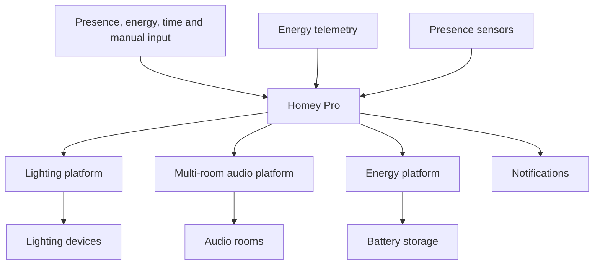

# System Overview

## Purpose

This public reference architecture is centered on **Homey Pro**. It combines vendor-native device control with cross-system logic for lighting, presence, energy, audio, climate, security, and notifications. It is illustrative—not a record of a live installation.

## Responsibility boundaries

| Layer | Primary responsibility |
|---|---|
| Physical installation | Safe electrical, network, sensor, and device installation |
| Native platforms | Device transport, local controls, firmware, and vendor-specific safety |
| Homey Pro | Cross-system decisions, variables, sequences, notifications, and user-facing automation |
| Handbook | Design intent, evidence, dependencies, operations, and change history |

## Confirmed platform baseline

- Homey Pro provides orchestration.
- lighting platform provides the lighting domain.
- presence-sensor devices provide presence inputs in confirmed rooms.
- Energy platforms provide storage and energy-telemetry contexts.
- A multi-room audio platform provides the principal audio domain; independent endpoints can remain separate audio domains.
- An electric vehicle creates an EV-charging use case for the energy strategy.

## Design priorities

1. Preserve safety and manual control.
2. Prefer reliable behavior over maximum automation.
3. Keep one owner for each durable state.
4. Test practical flows before marking them operational.
5. Bound failures to one subsystem where possible.
6. Avoid storing secrets or unnecessary personal data in the repository.

## Documentation boundary

The architecture chapters describe how the platform should be reasoned about. [Flow Catalogue](../05%20Homey/Flow%20Catalogue.md) describes what is actually implemented or proposed. A design appearing here does not prove that a Homey flow is deployed.

## Related

[The Home Intelligence Platform](The%20Home%20Intelligence%20Platform.md) · [Stateful Automation Architecture](Stateful%20Automation%20Architecture.md) · [Technology Stack](Technology%20Stack.md) · [Network Topology](Network%20Topology.md) · [ADR Index](ADRs/ADR%20Index.md)
