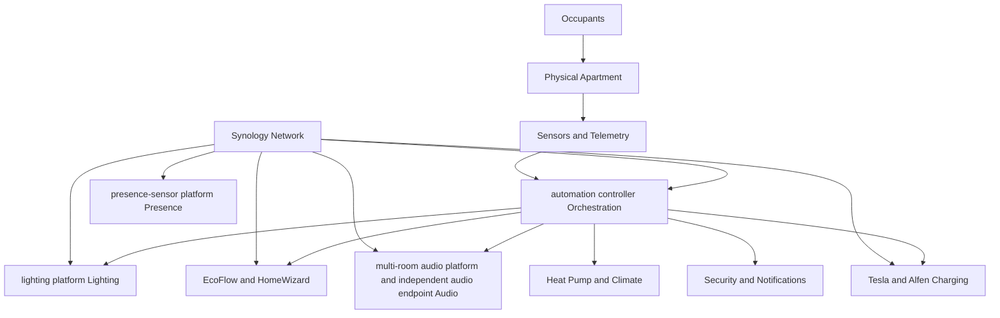
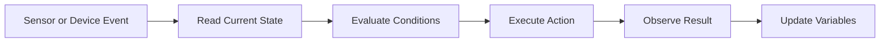

# The Home Intelligence Platform

> [!note] Architecture, not deployment proof
> This chapter defines responsibility boundaries and design principles. Confirm actual devices and flows through [Integration Index](../04%20Devices/Integration%20Index.md) and [Flow Catalogue](../05%20Homey/Flow%20Catalogue.md).

## 1. Purpose

The apartment is not designed as a collection of unrelated smart devices. It is designed as one integrated home-intelligence platform in which specialised subsystems cooperate through a shared automation layer.

The platform combines:

- automation controller for orchestration;
- lighting platform for lighting;
- presence-sensor platform for presence detection;
- EcoFlow for battery storage;
- HomeWizard for energy telemetry;
- multi-room audio platform for multi-room audio;
- independent audio endpoint for the Lounge Area audio zone;
- Tesla and Alfen for electric-vehicle charging;
- Synology for network infrastructure;
- the apartment itself as the physical system in which all automation operates.

The design objective is not maximum automation. The objective is a home that feels predictable, calm, efficient and maintainable.

## 2. Architectural View



The platform uses Homey as the coordination layer, but it does not assume that Homey should replace the native intelligence of every subsystem.

lighting platform remains responsible for reliable light control. EcoFlow remains responsible for battery protection and its internal operating logic. multi-room audio platform remains responsible for audio playback and grouping. Homey coordinates these systems based on context.

## 3. Architectural Layers

The platform can be understood as six layers.

### Layer 1: Physical environment

This is the apartment itself:

- rooms;
- hallways;
- doors;
- electrical circuits;
- solar generation;
- battery location;
- network coverage;
- human movement patterns.

Automation logic that ignores the physical environment will eventually behave badly. Room adjacency, sensor line of sight, acoustic separation and electrical constraints all affect the design.

### Layer 2: Devices and native platforms

Each device ecosystem provides a specialised capability.

| Platform | Primary responsibility |
|---|---|
| lighting platform | Lighting hardware, scenes and transitions |
| presence-sensor platform | Presence sensing and related telemetry |
| EcoFlow | Battery storage and internal battery management |
| HomeWizard | Grid and consumption telemetry |
| multi-room audio platform | Multi-room playback and grouping |
| independent audio endpoint | Lounge audio playback |
| Tesla | Vehicle state and charging behaviour |
| Alfen | Physical EV charging |
| Synology | Routing, WiFi and network availability |

### Layer 3: Integration

automation platforms expose devices and capabilities to the automation layer.

Typical capabilities include:

- presence detected;
- lux value changed;
- speaker is playing;
- join or leave a multi-room audio platform group;
- grid import exceeds a threshold;
- battery reserve changed;
- vehicle charging detected.

The quality of the platform depends partly on the quality and completeness of these integrations.

### Layer 4: State

Variables provide memory between individual events.

Examples include:

```text
Lux_Bathroom
Audio_Current_Room
Audio_Previous_Room
Audio_FollowMe
```

A state variable turns a sequence of isolated sensor events into a meaningful system condition.

### Layer 5: Orchestration

Advanced Flows combine triggers, conditions, actions, variables and delays.

Homey is most valuable at this layer because it can coordinate devices from different ecosystems.

Examples:

- presence plus lux controls lighting;
- EV charging detection changes battery reserve;
- destination-room presence transfers multi-room audio platform playback;
- humidity thresholds trigger climate or ventilation actions.

### Layer 6: Human experience

The final layer is the only layer the occupants should need to notice.

The desired experience is:

- lights appear when useful;
- music follows without interruption;
- batteries support the home without being drained unnecessarily;
- manual actions remain possible;
- failures do not make the apartment unusable.

## 4. Platform Responsibilities

A clear division of responsibility prevents overlapping logic and unpredictable behaviour.

### automation controller

Homey is the cross-system automation brain.

Responsibilities:

- read sensor and device state;
- evaluate conditions;
- maintain variables;
- execute Advanced Flows;
- coordinate different vendors;
- issue notifications;
- provide manual controls for automation modes.

Homey should not unnecessarily duplicate stable capabilities already handled well by a native platform.

### lighting platform

Hue is the primary lighting platform.

Responsibilities:

- reliable light control;
- scenes;
- dimming;
- colour temperature;
- fades and transitions;
- Zigbee lighting network.

Homey decides when and why a lighting change should occur. Hue performs the lighting action.

### presence-sensor platform

presence-sensor platform provides presence information.

Responsibilities:

- determine whether a room or transition space is occupied;
- support stationary-person detection;
- provide inputs for lighting, audio and future comfort logic.

Presence sensors are not treated as automation brains. They are evidence used by Homey.

### EcoFlow

EcoFlow is the energy-storage subsystem.

Responsibilities:

- battery protection;
- charge and discharge control;
- self-powered operation;
- reserve enforcement;
- internal safety logic.

Homey may influence reserve or operating behaviour, but EcoFlow retains authority over its internal battery-management functions.

### HomeWizard

HomeWizard provides energy telemetry.

Responsibilities:

- grid import and export measurement;
- household load measurement;
- energy-event detection;
- input for EV-charging and battery-protection logic.

### multi-room audio platform

multi-room audio platform is the primary multi-room audio platform.

Responsibilities:

- playback;
- room grouping;
- stereo pairing;
- volume;
- synchronisation between multi-room audio platform rooms.

Homey determines which multi-room audio platform room should participate in the current session.

### independent audio endpoint

The independent audio endpoint Lounge speaker is a separate audio domain.

It should not be assumed to support seamless grouping with multi-room audio platform. Cross-platform audio behaviour must therefore be designed separately from the multi-room audio platform follow-me domain.

### Synology network

The Home Network Gateway is the connectivity foundation.

Responsibilities:

- routing;
- WiFi;
- device connectivity;
- internet access;
- network stability.

A smart home with an unstable network is an unstable smart home, regardless of how good the automation logic is.

## 5. Control Flow

The normal control pattern is:



Example: bathroom lighting

1. Bathroom presence is detected.
2. Homey reads the measured lux value.
3. Homey compares lux with `Lux_Bathroom`.
4. If the room is dark enough, Homey activates the selected Hue scene.
5. Hue changes the lights.
6. Homey continues monitoring presence and lux.

Example: follow-me audio

1. Bathroom presence is detected.
2. Homey confirms that follow-me mode is enabled.
3. Homey checks that the current audio room is Office.
4. Bathroom multi-room audio platform joins the Office group.
5. After a short overlap, Office leaves the group.
6. `Audio_Current_Room` becomes Bathroom.

## 6. State Versus Events

An event is something that happens once.

Examples:

- presence detected;
- button pressed;
- charging started;
- lux changed.

State describes the current condition.

Examples:

- Bathroom is occupied;
- audio follow-me is enabled;
- Office owns the current audio session;
- the battery reserve is 90 percent;
- the home is in evening mode.

Reliable automations usually combine events and state.

An event starts the decision process. State prevents the system from reacting incorrectly.

## 7. Cross-System Services

The platform provides several higher-level services.

### Presence service

Combines room sensors and apartment topology to determine meaningful occupancy.

Consumers:

- lighting;
- audio;
- notifications;
- climate;
- security.

### Lighting service

Combines presence, lux, time and manual overrides to select appropriate scenes.

### Audio service

Maintains the active playback destination and transfers playback between compatible rooms.

### Energy service

Combines solar generation, household load, battery state and EV charging to minimise unnecessary grid use and battery discharge.

### Notification service

Routes important messages to appropriate channels and avoids unnecessary notification noise.

### Climate service

Uses temperature, humidity, occupancy and equipment state to protect comfort and the building.

## 8. Failure Domains

The design assumes that components can fail.

### Internet failure

Expected behaviour:

- local device control should continue where supported;
- cloud-dependent integrations may stop updating;
- manual controls remain available;
- critical safety should not depend exclusively on cloud services.

### Homey failure

Expected behaviour:

- Hue remains usable through native controls;
- multi-room audio platform remains usable through the multi-room audio platform app;
- EcoFlow continues its internal operating mode;
- Tesla and Alfen remain independently operable;
- automations pause, but the home remains usable.

### Sensor failure

Expected behaviour:

- one failed sensor should affect only its related logic;
- manual control remains possible;
- automations should fail conservatively;
- the system should avoid repeatedly toggling devices based on unstable input.

### Network failure

Expected behaviour:

- locally paired systems may continue internally;
- WiFi and cloud integrations may become unavailable;
- recovery starts with network verification before flow redesign.

## 9. Manual Control

Manual control is a design requirement, not an exception.

Occupants must be able to:

- switch lights manually;
- stop or redirect audio;
- disable follow-me behaviour;
- override scenes;
- change battery or charging settings in native apps;
- continue using the apartment when Homey is unavailable.

Automation must support the occupants rather than compete with them.

## 10. Security and Privacy Boundaries

The platform contains sensitive information:

- room occupancy;
- movement patterns;
- energy use;
- device status;
- network structure;
- household routines.

Design implications:

- the GitHub repository remains private;
- credentials are not stored in the handbook;
- local processing is preferred where practical;
- remote access is limited to trusted platforms;
- screenshots and exported files should be reviewed before public sharing.

## 11. Lifecycle

Every subsystem progresses through four stages.

### Design

Define the behaviour and constraints.

### Pilot

Build the smallest useful flow and test it in real life.

### Stabilise

Correct timing, edge cases and unwanted interactions.

### Document

Record the final implementation, rationale and limitations.

This sequence ensures that the handbook describes working reality rather than untested theory.

## 12. Platform Principles

### Reliability before novelty

A simple flow that works every day is better than an impressive flow that fails unpredictably.

### Native strength, central coordination

Each platform performs the task it handles best. Homey coordinates across platforms.

### Manual override remains available

Automation never removes basic control from the occupants.

### State is explicit

Important cross-flow conditions are represented through clear variables or device states.

### Failures remain bounded

One unavailable sensor or cloud integration should not make the entire home unusable.

### Iteration is preferred

A small working pilot is expanded only after it proves reliable.

### Documentation follows evidence

The handbook may explain theory, but implementation records must reflect tested behaviour.

## 13. Evolution Roadmap

The platform can evolve in several directions.

### Short term

- complete the first multi-room audio platform follow-me routes;
- finish presence coverage in Kitchen and Gym;
- add the Front Hallway presence sensor;
- stabilise room lighting thresholds;
- document current EcoFlow charging-protection flows.

### Medium term

- add multi-person behaviour;
- distinguish personal and shared audio sessions;
- route announcements to occupied rooms;
- improve energy optimisation around solar and EV charging;
- add maintenance and device-health monitoring.

### Long term

- predictive room preparation;
- richer context based on routines;
- stronger local-first operation;
- deeper interoperability through evolving standards;
- a complete digital twin linking rooms, devices, flows and decisions.

## 14. Conclusion

The Home Intelligence Platform is not defined by a single hub or brand. It is defined by the cooperation between the physical apartment, specialised device platforms, explicit system state and a central orchestration layer.

automation controller coordinates the system, but the architecture remains distributed. Hue controls lighting. presence-sensor platform detects presence. EcoFlow manages stored energy. HomeWizard measures power. multi-room audio platform manages synchronous audio. Synology keeps the network available.

The platform succeeds when these components disappear into the background and the apartment behaves as one coherent system.
