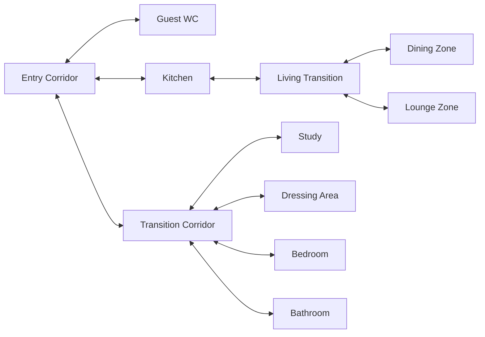

# Zone Design

> [!note] Illustrative topology
> The zones below are a teaching model for stateful automation. They are not a floor plan, a record of sensor placement or a description of any real property.

## Bidirectional topology

The model allows movement in both directions and between branches through the Entry Corridor. Real homes need their own topology, measured coverage and privacy review.

## Illustrative service coverage

| Room | Presence | Audio | Classification |
|---|---|---|---|
| [Entry Corridor](Entry%20Corridor.md) | Planned | None recorded | Transition |
| [Transition Corridor](Transition%20Corridor.md) | Current | None | Transition |
| [Guest WC](Guest%20WC.md) | Not recorded | None recorded | Destination |
| [Kitchen](Kitchen.md) | Two planned sensors | multi-room audio | Destination |
| [Living Transition](Living%20Transition.md) | Not recorded | None recorded | Transition |
| [Dining Zone](Dining%20Zone.md) | Not recorded | None recorded | Destination |
| [Lounge Zone](Lounge%20Zone.md) | Current | independent audio endpoint | Destination/separate audio domain |
| [Study](Study.md) | Current | multi-room audio stereo pair | Destination |
| [Dressing Area](Dressing%20Area.md) | Current | multi-room audio | Destination |
| [Bedroom](Bedroom.md) | Not recorded | None recorded | Destination |
| [Bathroom](Bathroom.md) | Current | multi-room audio | Destination |
| [Exercise Area](Exercise%20Area.md) | Planned | multi-room audio | Destination; adjacency not confirmed |
| [Utility Area](Utility%20Area.md) | Not recorded | None recorded | Service area; adjacency not documented |

“Not recorded” is not the same as “absent.” Update the individual page after physical verification.
