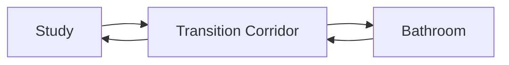
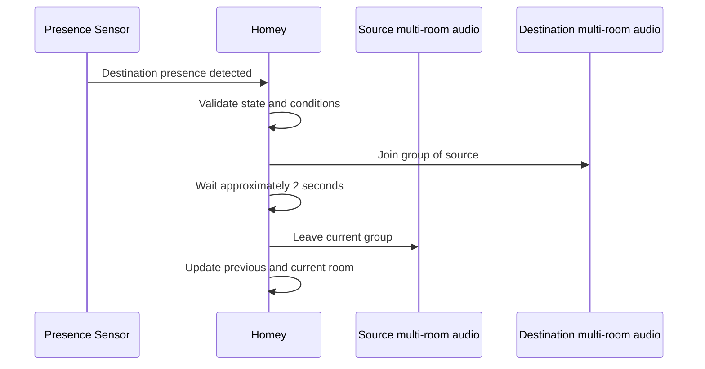

# Follow-Me Audio

> [!warning] Implementation status
> This is a **proposed pattern**, not a verified whole-home feature. Confirm the group-handover sequence against your own automation platform and audio platform. The Study-to-Bathroom route is an illustrative acceptance scenario.

## 1. Purpose
Follow-me audio moves an active listening session from one destination zone to another after a confirmed movement sequence.

The aim is continuity, not omnipresence. Music should remain audible in the occupied destination without unnecessarily continuing in the room that was left behind.

This chapter separates the engineering model from the practical Homey implementation. Implementation details remain marked as draft until the relevant route has been tested in the reference home.

## Pattern: reconcile distributed audio deliberately

A room-presence audio service may reconcile grouping, volume, mute, playback,
and shuffle for a small set of zones. This is a pattern, not proof of a
universal implementation. If playback restarts unexpectedly, retain that as an
unresolved incident until a reproducible cause is established. For five or six
zones, centralising room mapping and transfer locking is a proposed scaling
step; validate recovery and manual behaviour before expanding scope.

## 2. Scope

### Included

- automation-controller orchestration
- presence platform presence events
- multi-room audio room grouping
- current-room and previous-room state
- single-listener movement between supported rooms
- route validation through transition spaces
- manual enable and disable control

### Excluded for the first release

- simultaneous personal sessions for multiple occupants
- seamless multi-room audio-to-independent audio endpoint transfer
- automatic source selection
- automatic playlist selection
- voice identification
- predictive routing

## 3. Audio Domains

The reference home illustrates two audio domains.

### multi-room audio domain

| Room | Device | Role |
|---|---|---|
| Study | Two multi-room audio speakers configured as one stereo room | Supported destination |
| Bathroom | multi-room audio | Supported destination |
| Dressing Area | multi-room audio | Supported destination |
| Kitchen | multi-room audio | Future supported destination after presence coverage |
| Exercise Area | multi-room audio | Future supported destination after presence coverage |

### independent audio endpoint domain

| Room | Device | Role |
|---|---|---|
| Lounge Zone | independent audio endpoint speaker | Separate audio domain |

The first pattern remains inside the multi-room audio domain because multi-room audio supports native room grouping. The independent audio endpoint Lounge Zone should not be represented as a normal multi-room audio destination.

## 4. Presence Topology

The first illustrative route is:

```text
Study -> Transition Corridor -> Bathroom
```

The rooms have different roles:

- Study: origin or destination
- Transition Corridor: transition space
- Bathroom: destination

The hallway should support route interpretation, but should not become the final audio destination.



## 5. Design Principle

A room should receive audio only when all required conditions are true:

1. Follow-me mode is enabled.
2. A supported destination becomes occupied.
3. Audio is currently active in another supported room.
4. The stored current room matches the room that owns the active session.
5. No conflicting transfer is already in progress.

A presence event alone should not start new music. It should only move an existing session.

## 6. State Model

### Core variables

```text
Audio_Current_Room
Audio_Previous_Room
Audio_FollowMe
```

Recommended initial values for the first Study-based test:

```text
Audio_Current_Room = Study
Audio_Previous_Room = Study
Audio_FollowMe = Yes
```

### Optional transfer lock

```text
Audio_Transfer_In_Progress
```

Recommended normal value:

```text
Audio_Transfer_In_Progress = No
```

The lock is not mandatory for the first one-way test. It becomes useful when both directions are enabled and presence events can overlap.

### Valid room values

```text
None
Study
Bathroom
Dressing Area
Kitchen
Exercise Area
```

Kitchen and Exercise Area remain future values until their practical presence logic is available.

## 7. State Responsibilities

| Variable | Meaning | Owner |
|---|---|---|
| `Audio_Current_Room` | multi-room audio room currently owning the automated session | Audio service |
| `Audio_Previous_Room` | Last room that owned the session | Audio service |
| `Audio_FollowMe` | Whether automatic transfer is allowed | Occupant intent |
| `Audio_Transfer_In_Progress` | Whether a handover is underway | Audio service |

multi-room audio remains the source of truth for whether playback is actually active. The variables describe automation context, not raw device state.

## 8. Transfer Pattern

A multi-room audio transfer uses a temporary group overlap:

1. Destination joins the source group.
2. Both rooms play briefly.
3. Source leaves the group.
4. Destination remains as the active room.
5. Homey updates its state variables.



The two-second overlap is a starting value, not a final specification. It must be validated in practice.

## 9. First Route: Study to Bathroom

### Trigger

```text
Bathroom presence becomes active
```

### Required conditions

```text
Audio_FollowMe = Yes
Audio_Current_Room = Study
Study multi-room audio is playing
```

Optional later condition:

```text
Transition Corridor was active recently
```

The hallway condition should not be required for the first multi-room audio handover test. First prove that the audio transfer itself works. Add route validation only after the transfer mechanism is reliable.

### Action sequence

```text
1. Audio_Previous_Room = Study
2. Bathroom multi-room audio joins the group of Study multi-room audio
3. Wait 2 seconds
4. Study multi-room audio leaves its current group
5. Audio_Current_Room = Bathroom
```

When a transfer lock is introduced:

```text
1. Audio_Transfer_In_Progress = Yes
2. Audio_Previous_Room = Study
3. Bathroom multi-room audio joins the group of Study multi-room audio
4. Wait 2 seconds
5. Study multi-room audio leaves its current group
6. Audio_Current_Room = Bathroom
7. Audio_Transfer_In_Progress = No
```

## 10. Reverse Route: Bathroom to Study

### Trigger

```text
Study presence becomes active
```

### Required conditions

```text
Audio_FollowMe = Yes
Audio_Current_Room = Bathroom
Bathroom multi-room audio is playing
```

### Action sequence

```text
1. Audio_Previous_Room = Bathroom
2. Study multi-room audio joins the group of Bathroom multi-room audio
3. Wait 2 seconds
4. Bathroom multi-room audio leaves its current group
5. Audio_Current_Room = Study
```

The reverse route should only be enabled after the first route has been tested. This prevents two-way loops from obscuring a basic grouping problem.

## 11. Homey Card Mapping

The available multi-room audio cards provide the required actions.

### Condition

```text
Is playing
```

Use the card from the current source room.

### Destination action

```text
Join the group of [player]
```

Use the card from the destination room and select the source room as the player.

For Study to Bathroom:

```text
Device: Bathroom multi-room audio
Card: Join the group of [player]
Player: Study multi-room audio
```

### Source action

```text
Leave current group
```

Use the card from the source room.

For Study to Bathroom:

```text
Device: Study multi-room audio
Card: Leave current group
```

## 12. Initial Test Procedure

### Preparation

1. Enable `Audio_FollowMe`.
2. Set `Audio_Current_Room = Study`.
3. Set `Audio_Previous_Room = Study`.
4. Start music manually in Study.
5. Ensure Bathroom is initially unoccupied.
6. Enable only the Study-to-Bathroom flow.

### Test

1. Leave Study.
2. Walk through Transition Corridor.
3. Enter Bathroom.
4. Remain in Bathroom for several seconds.

### Expected result

```text
Bathroom joins the Study playback.
Both rooms may play for approximately 2 seconds.
Study leaves the group.
Playback continues in Bathroom.
Audio_Current_Room becomes Bathroom.
Audio_Previous_Room becomes Study.
```

## 13. Test Outcomes

### Outcome A: successful handover

- Bathroom begins playing.
- Study stops after the delay.
- Bathroom continues without restarting the track.
- variables match reality.

This validates the basic transfer pattern.

### Outcome B: Bathroom joins, but Study keeps playing

Investigate:

- whether the Study leave-group action ran;
- whether the delay connection is correct;
- whether the leave card is attached to the Study device;
- whether the source and coordinator behaviour differs from expectation.

### Outcome C: nothing happens

Investigate in this order:

1. Did the Bathroom presence trigger fire?
2. Was `Audio_FollowMe` equal to `Yes`?
3. Was `Audio_Current_Room` exactly `Study`?
4. Did Homey report Study multi-room audio as playing?
5. Did the join-group action execute?

### Outcome D: playback stops everywhere

The assumed multi-room audio coordinator behaviour is incorrect for this grouping sequence. Test an alternative handover order or a different group coordinator strategy before enabling more routes.

## 14. Route Validation

Once the basic transfer works, Transition Corridor can improve route confidence.

Two possible methods exist.

### Method A: hallway currently active

```text
AND Transition Corridor presence is active
```

This is simple but timing-sensitive. The hallway may already report empty by the time Bathroom presence becomes active.

### Method B: recent hallway event

Store a timestamp or temporary route flag when Transition Corridor activates.

Example:

```text
Presence_Last_Transition = Transition Corridor
Presence_Last_Transition_Recent = Yes
```

The Bathroom flow can then require the recent transition flag.

This is more reliable but should only be added when false transfers justify the additional complexity.

## 15. Manual Control

Follow-me audio must remain optional.

### Enable

```text
Audio_FollowMe = Yes
```

### Disable

```text
Audio_FollowMe = No
```

When disabled:

- existing playback should continue unchanged;
- Homey should stop moving the session;
- manual multi-room audio grouping remains possible.

Disabling follow-me should not automatically stop music.

## 16. Session Initialisation

The system needs a way to establish `Audio_Current_Room` when music is started manually.

Initial practical approach:

- manually set `Audio_Current_Room` before testing;
- later add playback-start flows per supported room.

Example future flow:

```text
WHEN Study multi-room audio starts playing
AND Bathroom multi-room audio is not part of the same active session
THEN Audio_Current_Room = Study
```

This requires care because grouped multi-room audio rooms may all report playback. The system should not overwrite current-room ownership repeatedly during a normal transfer.

## 17. Stopping Playback

When the active multi-room audio session stops, the automation should eventually return to an idle state.

Possible behaviour:

```text
Audio_Current_Room = None
Audio_Previous_Room = last active room
```

This should not be added until the playing and grouping states are understood in practice.

## 18. Multi-Person Limitation

The initial design assumes one relevant moving listener.

Example conflict:

- Occupant A remains in Study.
- Occupant B enters Bathroom.
- Study music is playing.

A destination-only trigger may move Occupant A's session to Bathroom even though he did not leave.

Possible future protections include:

- require source room to become empty;
- require a recent hallway route;
- introduce a short destination confirmation delay;
- identify a personal session owner;
- add shared-audio mode;
- allow persistent multi-room playback.

No identity-based solution should be documented as operational until the required signals exist.

## 19. Scaling Model

A hard-coded pair of flows works for the first route, but does not scale elegantly across five or six rooms.

For `n` rooms, direct pairwise routes can approach:

```text
n x (n - 1)
```

For five multi-room audio rooms, that can mean up to twenty directional transfers.

Three scaling options exist.

### Option 1: pairwise Advanced Flows

Advantages:

- visible;
- easy to test one route at a time;
- no scripting dependency.

Disadvantages:

- repeated logic;
- many flows;
- harder global maintenance.

### Option 2: destination flows with source branches

Each destination has one Advanced Flow with branches for each possible current room.

Advantages:

- fewer trigger flows;
- destination logic remains visible.

Disadvantages:

- still repetitive;
- large Advanced Flows can become difficult to read.

### Option 3: HomeyScript transfer service

One script receives source and destination, performs grouping and updates variables.

Advantages:

- centralised transfer logic;
- easier locking and error handling;
- scalable room mapping.

Disadvantages:

- less visual;
- requires reliable API access and scripting maintenance.

The recommended engineering sequence is:

1. prove the multi-room audio transfer with one Advanced Flow;
2. prove the reverse direction;
3. prove one additional room;
4. only then decide whether scripting is justified.

## 20. Failure Modes

| Failure | Effect | Mitigation |
|---|---|---|
| Destination presence false positive | Audio moves unnecessarily | Add route validation or confirmation delay |
| Source still occupied | Audio is removed from an active listener | Require source-empty logic or multi-room policy |
| Join-group action fails | Destination remains silent | Keep current-room state unchanged and retry manually |
| Leave-group action fails | Both r…1776 tokens truncated…DR-005 Protect Storage During EV Charging]] · [Integration Roles](../../01%20Architecture/Integration%20Roles.md) · [Flow Catalogue](../../05%20Homey/Flow%20Catalogue.md)
