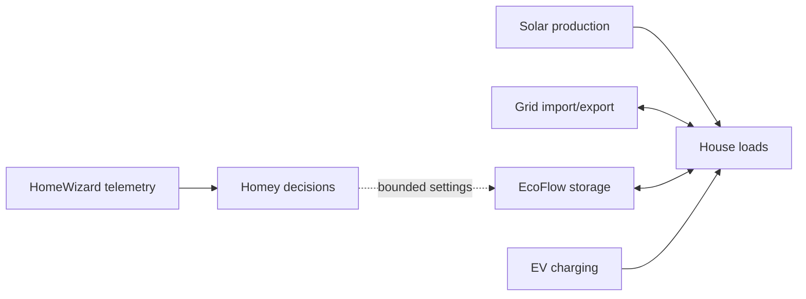
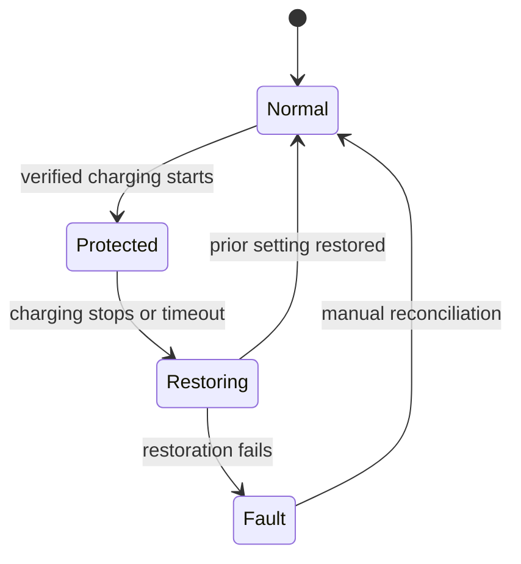

# Energy Management

## Objective

Use measured energy state to improve self-consumption and peak behavior without overriding device protections or leaving temporary settings behind.

## Confirmed components

- Two [[Residential Battery System]] units.
- One [[Energy Metering Gateway]].
- [[automation controller]] orchestration.
- [[Electric Vehicle]] charging context.
- Solar generation is part of the stated strategy; inverter/panel details are not inventoried.

## Responsibility boundary

EcoFlow retains native battery management and safety. HomeWizard supplies verified measurements. Homey may coordinate reversible high-level actions; it is not a battery management system or billing meter.

## Principal use cases

| Use case | Status | Required evidence |
|---|---|---|
| Observe grid import/export | Partially verified | Exact HomeWizard signals and units |
| Favor solar self-consumption | Architecture | Native EcoFlow settings and observed behavior |
| Prevent undesirable discharge during EV charging | Proposed/partially verified | Reliable charging signal, exact reserve card, restore test |
| Peak shaving | Proposed | Import limits, battery constraints, acceptance data |
| Backup reserve | Partially verified concept | Supported range, normal value, temporary value, recovery |

## EV protection state machine

## Safety and reliability rules

- Do not identify EV charging from grid import alone unless false positives are acceptable and tested.
- Save the prior target before applying a temporary one.
- Validate units, sign conventions, limits, and device availability.
- Include timeout/restart reconciliation.
- Never defeat manufacturer protections or qualified electrical design.

## Pattern: temporary EV-charge protection

If a trustworthy charging signal is available, an orchestrator may temporarily
raise a supported storage reserve to avoid discharge into a vehicle. Save the
previous setting first, restore or reconcile when charging ends, and include a
timeout plus restart recovery. Do not assume a grouped command controls every
battery: verify command scope and native-platform behaviour for the installation.

## Related

[[ADR-004 Retain Native Battery Safety Controls]] · [[ADR-005 Protect Storage During EV Charging]] · [[Integration Index]] · [[Flow Catalogue]]
