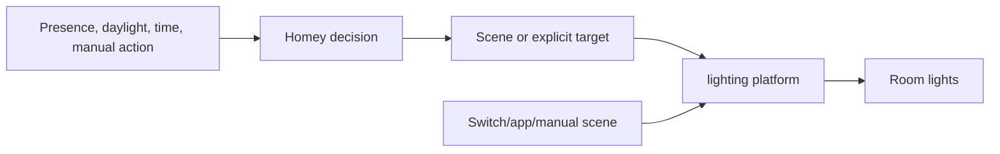

# Lighting

## Objective

Provide safe, comfortable light that reacts predictably to occupancy, daylight, time, and manual intent. The confirmed platform is lighting platform; the exact fixture, scene, and threshold inventory remains incomplete.

## Architecture

## Control order

1. Safety-critical/manual action.
2. Active manual override.
3. Room occupancy and vacancy.
4. Daylight/lux eligibility.
5. Time/quiet-hours scene selection.
6. Energy optimization that does not compromise safe use.

## Room design record

Each room must record:

- fixtures and Hue group/zone;
- sensor and lux source;
- entry, occupied, ambient, night, and off scenes;
- vacancy delay and fade duration;
- manual-override trigger and reset;
- failure behavior if presence or Homey is unavailable.

## Guardrails

- Do not use one universal lux threshold for every room.
- Do not turn lights off from a single negative presence event without a suitable vacancy rule.
- Prefer explicit scenes/targets over toggles.
- Do not claim sub-second response or exact transition values until measured.
- Keep physical/native controls functional.

## Current maturity

The Hue platform is confirmed, but detailed room implementation is not evidenced in this repository. Lighting flows remain `proposed` in [Flow Catalogue](../../05%20Homey/Flow%20Catalogue.md) until screenshots/exports and real-world tests are added.

## Acceptance pattern

For every room, test entry in darkness, entry in daylight, sustained low motion, manual override, vacancy, Homey outage, and sensor failure.

## Pattern: separate time from house mode

Treat time of day as a behavioural input rather than a household mode. Lighting
can use it as its primary scene selector while separately reading occupancy,
ambient light, manual override, and exceptional modes such as sleep or away.
When daylight changes during continued occupancy, re-evaluate eligibility; do
not infer vacancy. The choice to fade, change a scene, or wait is a local,
tested room-policy decision.

## Related

[Lighting Platform](../../04%20Devices/Lighting%20Platform/Lighting%20Platform.md) · [Presence Detection](../Presence/Presence%20Detection.md) · [Zone Design](../../02%20Rooms/Zone%20Design.md) · [ADR-002 Keep Lighting Control in the Lighting Platform](../../01%20Architecture/ADRs/ADR-002%20Keep%20Lighting%20Control%20in%20the%20Lighting%20Platform.md)
