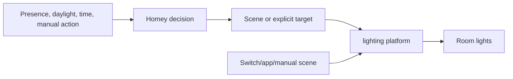

# Lighting

## Objective

Provide safe, comfortable light that reacts predictably to occupancy, daylight, time, and manual intent. The lighting platform is confirmed; the exact fixture, scene, and threshold inventory remains incomplete.

## Architecture


```mermaid
flowchart LR
    Inputs[Presence, daylight, time, manual action] --> Homey[Homey decision]
    Homey --> Intent[Scene or explicit target]
    Intent --> Hue[lighting platform]
    Hue --> Lights[Room lights]
    Manual[Switch/app/manual scene] --> Hue
```

## Control order

1. Safety-critical/manual action.
2. Active manual override.
3. Room occupancy and vacancy.
4. Daylight/lux eligibility.
5. Time/quiet-hours scene selection.
6. Energy optimization that does not compromise safe use.

## Room design record

Each room must record:

- fixtures and Hue group/zone;
- sensor and lux source;
- entry, occupied, ambient, night, and off scenes;
- vacancy delay and fade duration;
- manual-override trigger and reset;
- failure behavior if presence or Homey is unavailable.

## Guardrails

- Do not use one universal lux threshold for every room.
- Do not turn lights off from a single negative presence event without a suitable vacancy rule.
- Prefer explicit scenes/targets over toggles.
- Do not claim sub-second response or exact transition values until measured.
- Keep physical/native controls functional.

## Current maturity

In daily use in the reference home: presence- and daylight-driven lighting covers most zones. The patterns below come from that installation. Validate thresholds and timings in your own home.

## Acceptance pattern

For every room, test entry in darkness, entry in daylight, sustained low motion, manual override, vacancy, Homey outage, and sensor failure.

## Pattern: separate time from house mode

Treat time of day as a behavioural input rather than a household mode. Lighting
can use it as its primary scene selector while separately reading occupancy,
ambient light, manual override, and exceptional modes such as sleep or away.
When daylight changes during continued occupancy, re-evaluate eligibility; do
not infer vacancy. The choice to fade, change a scene, or wait is a local,
tested room-policy decision.

## Patterns from the reference home

**Context owns the targets.** A single context flow sets a target light level (lux) per zone whenever the time-of-day period changes. Lighting flows only *read* those targets. Tuning the house then means editing one table, not dozens of flows. A target of 0 is a deliberate "no automatic light in this period".

**Scene and intensity are separate layers.** A script chooses the *character* of the light (a scene per zone and period, with the Night scene forced while the house is asleep and nothing at all while it is away). Where a zone needs it, a second step sets the *intensity* from the shortfall between target and measured lux:

```text
maximum    = { Morning: 70, Day: 80, Evening: 55, Night: 20 }[period]
shortfall  = clamp((target_lux - current_lux) / target_lux, 0, 1)
brightness = round(3 + (maximum - 3) * shortfall)
```

Functional zones (cooking, dining) can use one fixed scene and skip the intensity layer.

**Switch off with a re-check, fade only where it matters.** Vacancy starts a delay, then re-checks that the zone is still empty before acting. Zones with calculated brightness dim to a minimum, wait, then switch off; fixed-scene zones switch straight off.

**Multi-sensor zones join before switching off.** When one zone is covered by several inputs (for example a presence sensor plus radar sub-zones), each input clears its own flag and the lights go off only when *all* flags are clear.

**Overrides gate switch-on, never switch-off.** A one-tap dashboard override blocks automatic switch-on for a zone. Switch-off logic is never gated, so an overridden zone cannot get stuck on.

**Seasonal policy is a design decision.** Disconnecting a zone's switch-on path outside the season where it is useful is legitimate, as long as it is recorded so nobody "fixes" it.

## Related

[Lighting Platform](../../04%20Devices/Lighting%20Platform/Lighting%20Platform.md) · [Presence Detection](../Presence/Presence%20Detection.md) · [Zone Design](../../02%20Rooms/Zone%20Design.md) · [ADR-002 Keep Lighting Control in the Lighting Platform](../../01%20Architecture/ADRs/ADR-002%20Keep%20Lighting%20Control%20in%20the%20Lighting%20Platform.md)
