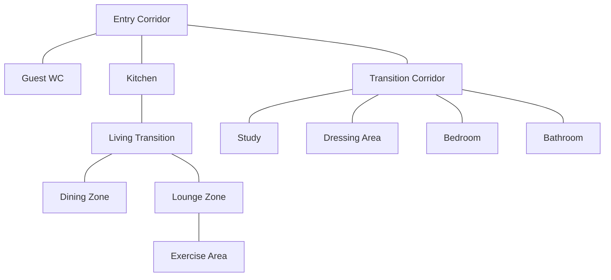

# Presence Intelligence

> [!note] Textbook architecture
> This chapter explains a scalable model. Its zone graph and coverage examples are illustrative; implementation status belongs in [[Flow Catalogue]].

## 1. Introduction

Presence is the foundation of an intelligent home.

Most conventional smart-home automations react to isolated events:

- motion detected;
- door opened;
- light switched;
- room became empty.

These events are useful, but they do not describe what is actually happening in the home. A responsive home needs to understand occupancy as a changing state: which spaces are active, how people move between them, and which destination is most likely to matter next.

This chapter defines the conceptual presence layer for the reference home. It is intentionally broader than one sensor brand or one automation platform. Homey, presence platform and future devices are implementation tools. The system design begins with the physical layout and the behaviours the home is expected to support.

## 2. Presence Versus Motion

Motion is an event. Presence is a state.

A motion sensor typically answers:

> Did something move recently?

A presence sensor attempts to answer:

> Is someone still here?

That distinction matters because many useful activities involve little movement:

- working at a desk;
- reading;
- watching television;
- sleeping;
- showering;
- dressing;
- sitting at the dining table.

Motion-only automation often turns lights off too early, moves audio incorrectly, or treats still occupants as absent. Presence-based automation is better suited to comfort systems because it can maintain a room state even when the occupant is stationary.

## 3. Illustrative Zone Topology

The reference home has two principal circulation routes connected through the Entry Corridor.

### Route 1

Entry Corridor to Guest WC or Kitchen, then through the Living Transition toward the Dining Zone or Lounge Zone.

### Route 2

Entry Corridor to Transition Corridor, then toward the Study, Dressing Area, Bedroom or Bathroom.

Movement is bidirectional. A person can move forward or backward along either route, and can cross from one branch to the other through the Entry Corridor.



The graph is more useful than a linear room list because it captures adjacency. Adjacency determines which transitions are physically plausible and therefore which automation decisions are credible.

## 4. Destination Spaces and Transition Spaces

Not every space should be treated in the same way.

### Destination spaces

Destination spaces are rooms in which people normally remain for a meaningful period.

Examples:

- Study
- Dressing Area
- Bathroom
- Bedroom
- Kitchen
- Dining Zone
- Lounge Zone
- Exercise Area
- Guest WC

These spaces may own a lighting scene, an audio destination, a climate preference or a notification endpoint.

### Transition spaces

Transition spaces mainly indicate movement between destinations.

Examples:

- Entry Corridor
- Transition Corridor
- Living Transition

A transition space may still have lighting and presence detection, but it should usually not become the primary destination for follow-me audio or long-running comfort automations.

This distinction prevents unstable behaviour. A hallway detection should generally mean “movement is in progress,” not “the occupant has settled here.”

## 5. Current Sensor Deployment

### Present sensors

| Space | Presence sensor status | Role |
|---|---|---|
| Dressing Area | Illustrative | Destination detection |
| Bathroom | Illustrative | Destination detection |
| Study | Illustrative | Destination detection |
| Lounge Zone | Illustrative | Destination detection |
| Transition Corridor | Illustrative | Transition detection |

### Planned sensors

| Space | Planned deployment | Role |
|---|---:|---|
| Kitchen | 2 sensors | Destination detection and coverage across a larger room |
| Exercise Area | 1 sensor | Destination detection |
| Entry Corridor | 1 sensor | Transition detection |

### Future consideration

A sensor in the Living Transition would complete the transition-space coverage between Kitchen, Dining Zone and Lounge Zone.

## 6. Audio Coverage

The current audio deployment is:

| Space | Audio device | Integration group |
|---|---|---|
| Dressing Area | multi-room audio | Native multi-room audio follow-me zone |
| Bathroom | multi-room audio | Native multi-room audio follow-me zone |
| Study | 2 multi-room audio speakers configured as one stereo pair | Native multi-room audio follow-me zone |
| Kitchen | multi-room audio | Native multi-room audio follow-me zone |
| Exercise Area | multi-room audio | Native multi-room audio follow-me zone |
| Lounge Zone | independent audio endpoint | Separate audio platform |

The multi-room audio rooms can transfer playback through group join and group leave operations. The independent audio endpoint Lounge Zone cannot participate in a multi-room audio group, so seamless transfer between multi-room audio and independent audio endpoint cannot be assumed.

This creates two logical audio domains:

1. multi-room audio follow-me domain
2. independent audio endpoint Lounge domain

The first illustrative implementation should therefore remain inside the multi-room audio domain.

## 7. Occupancy Model

The minimum useful occupancy model distinguishes between three room states:

```text
Empty
Transition
Occupied
```

### Empty

No reliable presence is detected.

### Transition

Presence is detected in a circulation space. The occupant is likely moving between destinations.

### Occupied

Presence is confirmed in a destination room.

This model is deliberately simple. It is sufficient to improve lighting, audio and notification routing without introducing person tracking, probability scores or machine-learning logic.

## 8. Movement Interpretation

A movement sequence should be interpreted as a path, not as isolated detections.

Example:

```text
Study
Transition Corridor
Bathroom
```

The meaningful interpretation is:

```text
Current destination changed from Study to Bathroom.
```

The Transition Corridor event confirms the route but should not become the final destination.

Another example:

```text
Kitchen
Entry Corridor
Transition Corridor
Study
```

The interpretation is:

```text
Current destination changed from Kitchen to Study.
```

The hallway sensors add confidence and reduce accidental transfers caused by unrelated presence detections.

## 9. Applications

### Lighting

Presence can maintain lighting while a room remains occupied and reduce reliance on short motion timers.

A practical lighting decision can combine:

- room presence;
- lux level;
- time of day;
- manual override;
- vacancy timeout.

### Follow-me audio

Audio transfer should occur only when a destination room becomes occupied and the current audio session is active.

The multi-room audio implementation uses:

1. destination joins the current multi-room audio group;
2. short overlap delay;
3. previous room leaves the group.

This preserves playback continuity better than stopping one room and starting another independently.

### Climate

Presence can support room-level comfort decisions, such as prioritising the Study while occupied or reducing unnecessary conditioning in empty spaces.

### Notifications

Announcements can be routed to an occupied room instead of being broadcast throughout the reference home.

### Security

Presence state can distinguish expected internal movement from unexpected activity when the home is supposed to be empty.

## 10. Practical Homey Variables

The first follow-me audio implementation uses three variables:

```text
Audio_Current_Room
Audio_Previous_Room
Audio_FollowMe
```

Recommended initial values:

```text
Audio_Current_Room = Study
Audio_Previous_Room = Study
Audio_FollowMe = Yes
```

These variables are intentionally limited to the audio service. They should not be confused with a full multi-person occupancy engine.

### Purpose

| Variable | Purpose |
|---|---|
| `Audio_Current_Room` | Identifies the multi-room audio room currently owning playback. |
| `Audio_Previous_Room` | Retains the previous playback destination for transfer and recovery logic. |
| `Audio_FollowMe` | Enables or disables automatic transfer. |

## 11. First Illustrative Route

The initial test route is:

```text
Study -> Transition Corridor -> Bathroom
```

The transfer is triggered when Bathroom presence is detected while Study is the current audio room and follow-me mode is enabled.

Expected action sequence:

1. Set `Audio_Previous_Room` to `Study`.
2. Bathroom multi-room audio joins the Study multi-room audio group.
3. Wait approximately two seconds.
4. Study multi-room audio leaves the group.
5. Set `Audio_Current_Room` to `Bathroom`.

The reverse route can then be implemented using the same pattern.

## 12. Design Decisions

### Decision 1: Build inside the multi-room audio domain first

**Reason**  
multi-room audio supports native grouping. This gives the best chance of continuous playback with minimal complexity.

### Decision 2: Treat hallways as transition spaces

**Reason**  
A hallway detection should help validate a route but should not normally become the final audio destination.

### Decision 3: Start with simple variables

**Reason**  
The first working automation is more valuable than an elaborate but untested occupancy model.

### Decision 4: Use short iterative tests

**Reason**  
Each route can be validated independently before wider deployment.

## 13. Known Limitations

- independent audio endpoint cannot join a multi-room audio group.
- The Entry Corridor is not included in the first illustrative sensor set.
- Kitchen presence coverage is not yet complete.
- The system does not yet identify individual occupants.
- Simultaneous occupancy in multiple rooms may require different logic from single-person follow-me behaviour.
- Group timing and playback handover must be tested in practice.

## 14. Evolution Path

A sensible sequence is:

1. Study to Bathroom
2. Bathroom to Study
3. Study to Dressing Area
4. Dressing Area to Study
5. Bathroom to Dressing Area
6. Dressing Area to Bathroom
7. Add Kitchen after sensor installation
8. Add Exercise Area after sensor installation
9. Evaluate the independent audio endpoint Lounge separately
10. Add multi-person rules only when needed

## 15. Engineering Principle

Presence intelligence should make the home feel calmer, not more complicated.

The correct design is not the one with the most states or the most flows. It is the one that reliably supports the occupant with the least visible friction.
