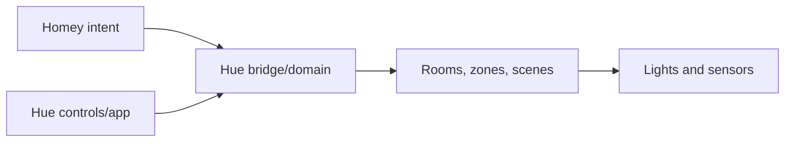

# Lighting Platform

## Role

lighting platform is the principal lighting domain. Homey selects room intent; Hue executes scenes or device targets and should retain native/manual control where installed.

## Inventory requirements

Record the bridge model/firmware, each fixture/sensor/control, canonical room, Hue name, Homey name, group/zone, scenes, protocol path, and manual fallback.

## Design rules

- Prefer stable scene names and explicit targets over toggles.
- Do not put competing automations in Hue and Homey without documenting precedence.
- Keep room-specific lux, transition, and vacancy behavior in [[Lighting]].
- Test what remains functional when Homey or the internet is unavailable.

## Verification required

Exact bridge/device inventory, room assignments, scenes, network connection, and outage behavior.

## Related

[[Lighting]] · [[ADR-002 Keep Lighting Control in the Lighting Platform]] · [[Integration Roles]]
