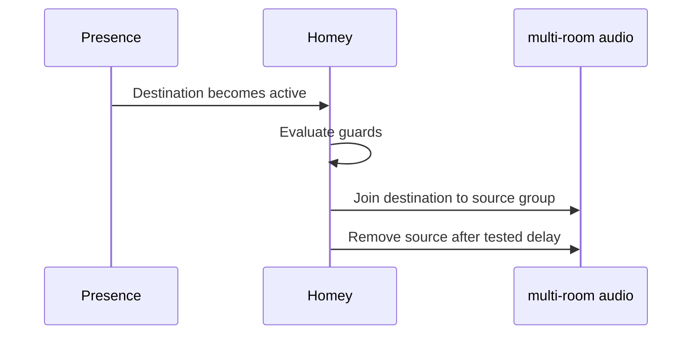

# Mermaid Standards

## Selection

- `flowchart` for responsibilities, dependencies, and decision flow.
- `sequenceDiagram` for time-ordered interactions.
- `stateDiagram-v2` for durable states and transitions.

## Rules

- Keep diagrams small enough to read in Obsidian.
- Use stable node IDs and short human labels.
- Quote labels containing punctuation when required.
- Show direction explicitly and label non-obvious edges.
- Distinguish confirmed topology from proposed paths in nearby prose.
- Do not put credentials, IP addresses, or sensitive security details in diagrams.
- Prefer one focused diagram over a page-wide “everything graph.”

## Example

Validate every Mermaid block in Obsidian after editing.
