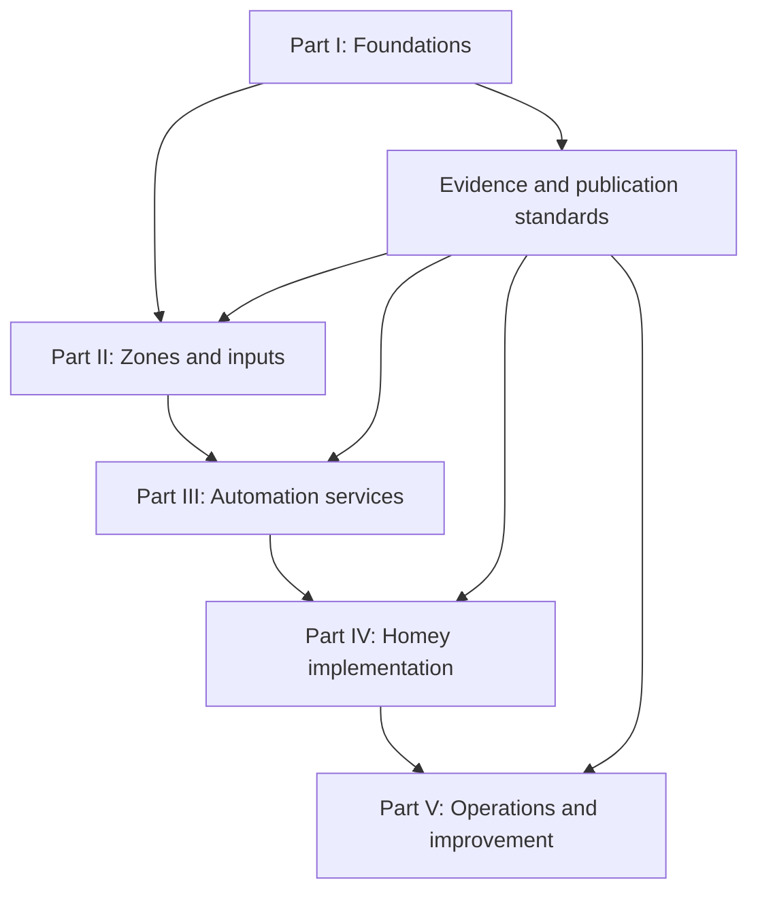

# Building a Stateful Smart Home

## Engineering Reliable Home Automation with Homey Pro

**Public edition:** `v1.2.0-rc.1`
**Format:** Obsidian-compatible Markdown
**Status:** v1.2.0-rc.1 release candidate — editorial review requested

This book explains how to design reliable, understandable home automation around **state**: the durable facts that let an automation reason about what is already true, rather than merely reacting to the last sensor event.

It is written for curious homeowners and integrators using **Homey Pro**. It does not require a programming background. Homey Pro is the practical orchestration example; the engineering principles also transfer to other platforms. This is an independent community resource, not affiliated with or endorsed by Homey.

Examples use a deliberately generic reference home and are labelled as **tested**, **pattern**, or **proposed** so a reader can distinguish evidence from an idea.

> [!warning] Public-edition boundary
> This edition contains no owner names, addresses, network identifiers, floor plans, credentials, serial numbers, security layouts, or operational device inventory. Zone names and integration roles are illustrative. It is a book, not a deployment record.

## Start reading

| If you want to… | Start here |
|---|---|
| Understand the core idea | [Preface](00%20Home/Preface.md) → [Stateful Automation Architecture](01%20Architecture/Stateful%20Automation%20Architecture.md) |
| Build a dependable first flow | [Advanced Flows](05%20Homey/Advanced%20Flows/Advanced%20Flows.md) → [Flow Catalogue](05%20Homey/Flow%20Catalogue.md) |
| Start with Homey Pro | [Homey Pro quick path](examples/README.md#homey-pro-quick-path) → [variable template](examples/variables/variable-template.md) → [flow blueprint](examples/flows/arrival-lighting-blueprint.md) |
| Try safe, anonymised examples | [Examples guide](examples/README.md) → [HomeyScript example](examples/homeyscript/occupancy-lighting.js) → [acceptance checklist](examples/acceptance-tests/occupancy-lighting-checklist.md) |
| Design lighting, presence, or audio | [System Index](03%20Systems/System%20Index.md) |
| Avoid unsafe or misleading claims | [Verification Standards](06%20Standards/Verification%20Standards.md) |
| Maintain an installation over time | [Operations](07%20Operations/Maintenance.md) |
| Find a term or topic | [Glossary](00%20Home/Glossary.md) → [Index](00%20Home/Index.md) |

## Book architecture

| Part | Folder | Purpose |
|---|---|---|
| Front matter | `00 Home` | How to read, publication policy, glossary, index, release notes |
| I. Foundations | `01 Architecture` | Design principles, state, responsibility boundaries, decision records |
| II. Zones | `02 Rooms` | Generic zone patterns: transition, destination, quiet, utility and open-plan spaces |
| III. Services | `03 Systems` | Lighting, presence, audio, energy, climate, notifications and security |
| IV. Integration and implementation | `04 Devices`, `05 Homey` | Platform roles, Homey logic, flows, variables and scripts |
| V. Publication and operations | `06 Standards`, `07 Operations`, `08 Roadmap` | Evidence, privacy, maintenance, recovery and safe evolution |

## Evidence labels

| Label | Meaning |
|---|---|
| **Tested** | Reproduced under stated conditions and accompanied by an acceptance check. |
| **Pattern** | A reusable design approach; validate it in your own installation. |
| **Proposed** | An intentionally untested design or future option. |
| **Reference** | Editorial guidance, standards, templates, or navigation. |

## Practical boundary

This book is educational. Electrical work, alarm systems, life-safety devices, vehicle charging and battery systems require the relevant manufacturer guidance and qualified professionals. Never use an automation as the only safety control.

## Reading in Obsidian

Open the repository folder as a vault, then begin with [Start Here](00%20Home/Start%20Here.md). Obsidian resolves the `internal links`, renders Mermaid diagrams, and makes the book searchable. Git is optional for reading; it is recommended when you adapt the material into your own private handbook.

## Publication materials

- [Preface](00%20Home/Preface.md)
- [How to Read This Book](00%20Home/How%20to%20Read%20This%20Book.md)
- [Publication Scope and Privacy](00%20Home/Publication%20Scope%20and%20Privacy.md)
- [Bibliography](00%20Home/Bibliography.md)
- [Glossary](00%20Home/Glossary.md)
- [Index](00%20Home/Index.md)
- [Release Notes](00%20Home/Release%20Notes.md)

## Examples and contribution

- [Safe examples and Homey Pro quick path](examples/README.md)
- [Reader and contributor guide](CONTRIBUTING.md)

## Licence and attribution

The handbook and accompanying documentation are licensed under [CC BY-SA 4.0](LICENSE.md). The runnable code in [`examples/`](examples/) is licensed separately under [MIT](examples/LICENSE). Third-party trademarks remain the property of their respective owners.
