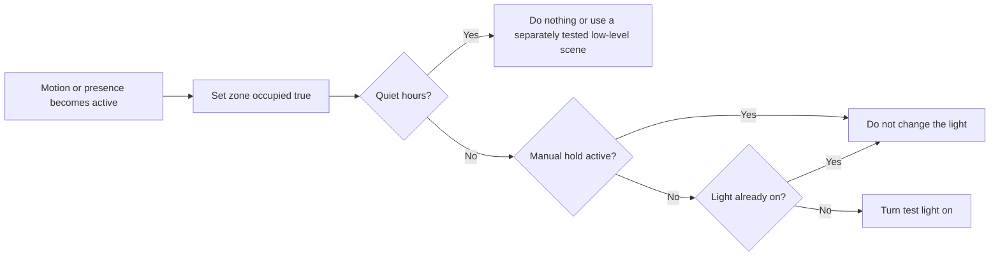

# Arrival Lighting Flow Blueprint

**Status:** Template / illustrative

Use this blueprint for a low-risk test zone such as a corridor. Do not begin with bedrooms, security routines or anything safety critical.

## Variables

- `zone.<zone>.occupied` — Boolean, initially `false`
- `zone.<zone>.manual_hold_until` — Date/time or empty
- `home.quiet_hours` — Boolean, initially `false`

## Advanced Flow logic

## Design notes

- Keep observation separate from action: record occupancy before deciding whether to operate a light.
- A manual wall-switch action should set a temporary manual hold, preventing the flow from immediately reversing a person's choice.
- The example intentionally omits exact durations. Choose and test them for one zone at a time.

Complete the [acceptance checklist](../acceptance-tests/occupancy-lighting-checklist.md) before expanding the pattern.
